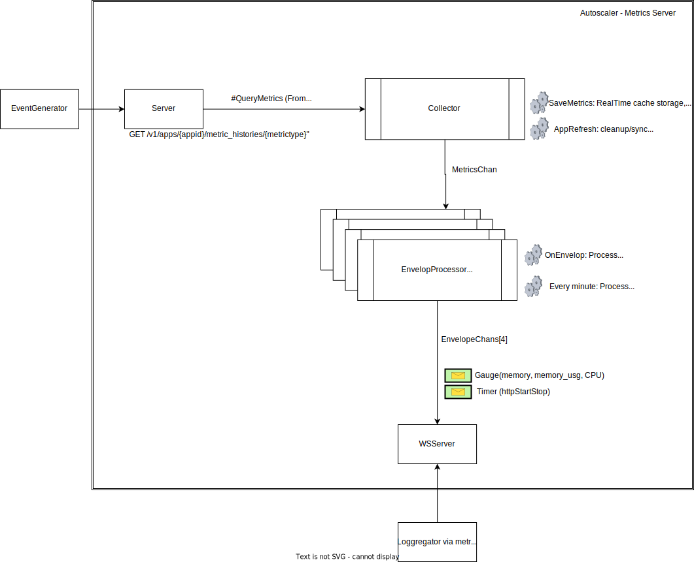
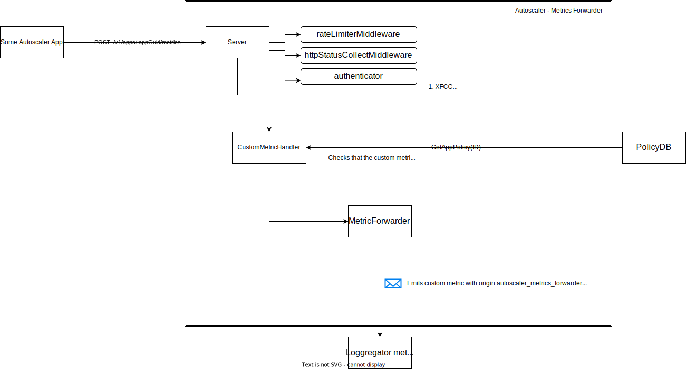

# Developer Guide

## Autoscaler Architecture

### Microservices

TBD

### MetricsGateway

**Responsabilities:**

- Talks to Loggregator via gRPC to fetch Gauge and Timer metrics.
- Dispatch and shard metrics to assigned Metric server via WSServer.
- Keeps track of current appIDs for which it should fetch metrics.
- Filters envelops for active AppPolicies.

### MetricsServer

**Responsabilities:**

- For Timer metrics it caches and compiles httpStartStop events to collect a average response time and throughput metric for a configured interval, by default 60 Seconds.
- Keeps track of current metrics sharded by node.
- if persistence is enabled, it stores metrics in DB.
- Provides HTTPServer GET endpoint to retrieve metrics_history by appid/metrictype.
- Transforms GAUGE envelopes into autoscaler compatible metrics (memoryutil, )

### EventGenerator

- Keeps Apps sharded by eventGenerator node.
- Fetches and caches AppPolicy's rules related metrics to evaluate scaling events.
- Evaluates app policies rules and generates scaling events based on metrics cache.
- Manages coolDown threshold for scaling events.

### MetricsForwarder

- Provides an HTTP server to stream app custom metrics to loggregator.
- Authenticate requests via XFCC or BasicAuth.
- Validates received metrics against app policy to check if it is a required metric.
- Manages coolDown threshold for scaling events.

