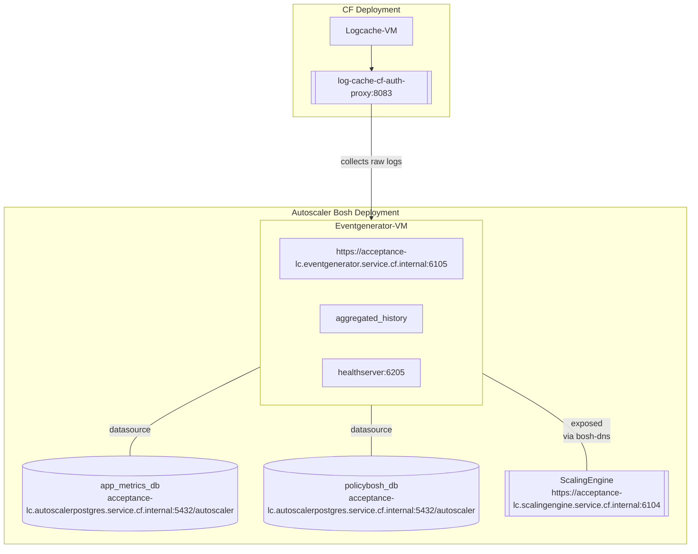
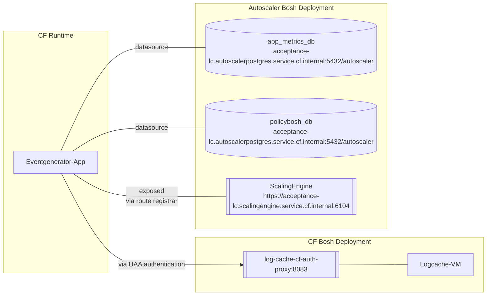

# Run Eventgenerator as CF App

==== WORK IN PROGRESS====
## Motivation

Deploy Autoscaler's eventgenerator service on a bosh vm is slow e.g vm creation/recover time

CF Runtime takes care of provisioning the missing app instances

## Eventgenerator on a Bosh VM

Autoscaler's eventgenerator components is used to collect raw metrics from log-cache and process them in to application metrics internally

Following diagram shows the interaction between external components e.g., databases, services

## Eventgenerator as CF Application

### Tasks
 - Run Eventgenerator service as CF app
 - Communicate with scalingengine via exposed route_registrar route
 - Communicate with logcache via uaa authentication
